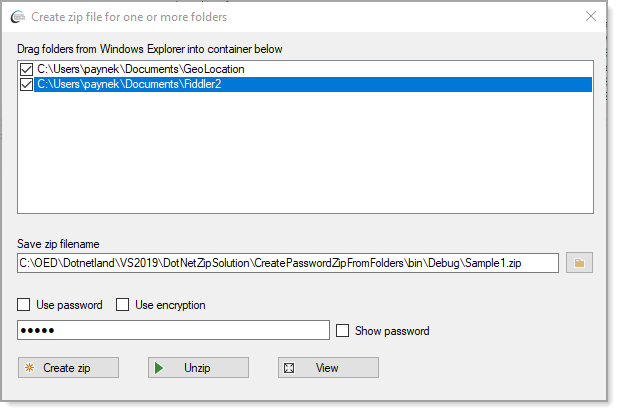
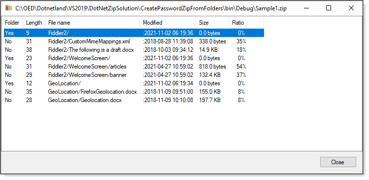

# About

Provides methods for

- Dropping folders into a ListView
- Specifying location and file name to create an archive (.zip) file using folders above
- Optionally adding a archive file password
- Option to view archive contents as per second image

**Main window**



**View archive file contents window**



```csharp
public List<Entry> ViewZipFileContents(string fileName)
{
    var entries = new List<Entry>();

    if (Directory.Exists(UnZipFolderName))
    {
        Directory.Delete(UnZipFolderName, true);
    }

    //var header = true;

    using (var zip = ZipFile.Read(fileName))
    {
        foreach (ZipEntry entry in zip)
        {
            //DebugView1(header, zip, entry);

            entries.Add(new Entry(entry));
        }
    }

    return entries;
}
```