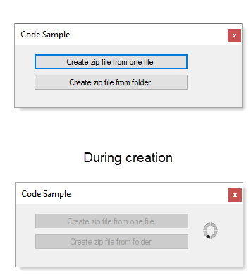

# About

Provides sample code to create a new archive/zip file from either a folder or a single file.



# Backend code

```csharp
using System;
using System.IO;
using System.IO.Compression;
using System.Threading.Tasks;

namespace CreateZipWithExtensions.Classes
{
    public static class ZipHelpers
    {
        /// <summary>
        /// Create an archive/zip file from either a directory or single file
        /// </summary>
        /// <param name="sourceName">Folder or file to create zip file for</param>
        /// <param name="zipFileName">Name of zip file which can include a path\file name</param>
        /// <returns>success and exception if a runtime exception was raised</returns>
        public static async Task<(bool success, Exception exception)> CreateEntryFromAnyAsync(string sourceName, string zipFileName)
        {
            
            var result =  await Task.Run(async () =>
            {
                await Task.Delay(0);

                try
                {

                    if (File.GetAttributes(sourceName).HasFlag(FileAttributes.Directory))
                    {
                        ZipFile.CreateFromDirectory(sourceName, zipFileName);
                    }
                    else
                    {
                        using (var zipFile = new ZipArchive(File.Create(zipFileName), ZipArchiveMode.Create))
                        {
                            zipFile.CreateEntryFromFile(sourceName, Path.GetFileName(sourceName));
                        }
                    }

                    return (true, null);

                }
                catch (Exception ex)
                {
                    return (false, ex);
                }
            });

            return result;

        }
    }
}
```

# Usage

Make sure to change paths before running.

```csharp
using System;
using System.Windows.Forms;
using CreateZipWithExtensions.Classes;

namespace CreateZipWithExtensions
{
    public partial class Form1 : Form
    {
        public Form1()
        {
            InitializeComponent();

            CreateZipWithOneFileButton.DataBindings.Add("Enabled", CreateZipFromFolderButton, "Enabled");

        }

        private async void CreateZipWithOneFileButton_Click(object sender, EventArgs e)
        {
            CreateZipFromFolderButton.Enabled = false;
            pictureBox1.Visible = true;

            try
            {
                var (success, exception) = await ZipHelpers.CreateEntryFromAnyAsync(
                    "C:\\OED\\Documents\\SpreadsheetLight.chm", FileHelpers.ZipFileName);
                if (success == false)
                {
                    MessageBox.Show($"Failed\n{exception.Message}");
                }
            }
            finally
            {
                CreateZipFromFolderButton.Enabled = true;
                pictureBox1.Visible = false;
            }
        }

        private async void CreateZipFromFolderButton_Click(object sender, EventArgs e)
        {
            CreateZipFromFolderButton.Enabled = false;
            pictureBox1.Visible = true;

            try
            {
                var (success, exception) = await ZipHelpers.CreateEntryFromAnyAsync(
                    "C:\\OED\\Documents", FileHelpers.ZipFileName);
                if (success == false)
                {
                    MessageBox.Show($"Failed\n{exception.Message}");
                }
            }
            finally
            {
                CreateZipFromFolderButton.Enabled = true;
                pictureBox1.Visible = false;
            }
        }
    }
}

```