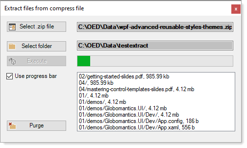

# Extract files from .zip

>This projects shows how to do a simple extract files from a .zip file with ProgressBar or with a Delegate to provide progress during file extraction in Visual Basic.

- Took my VB.NET solution and converted to C#
- Convertions works yet if to be used desires some clean-up

