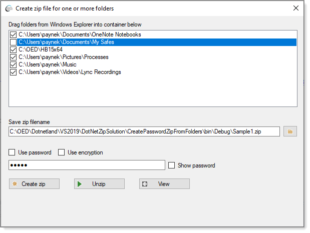
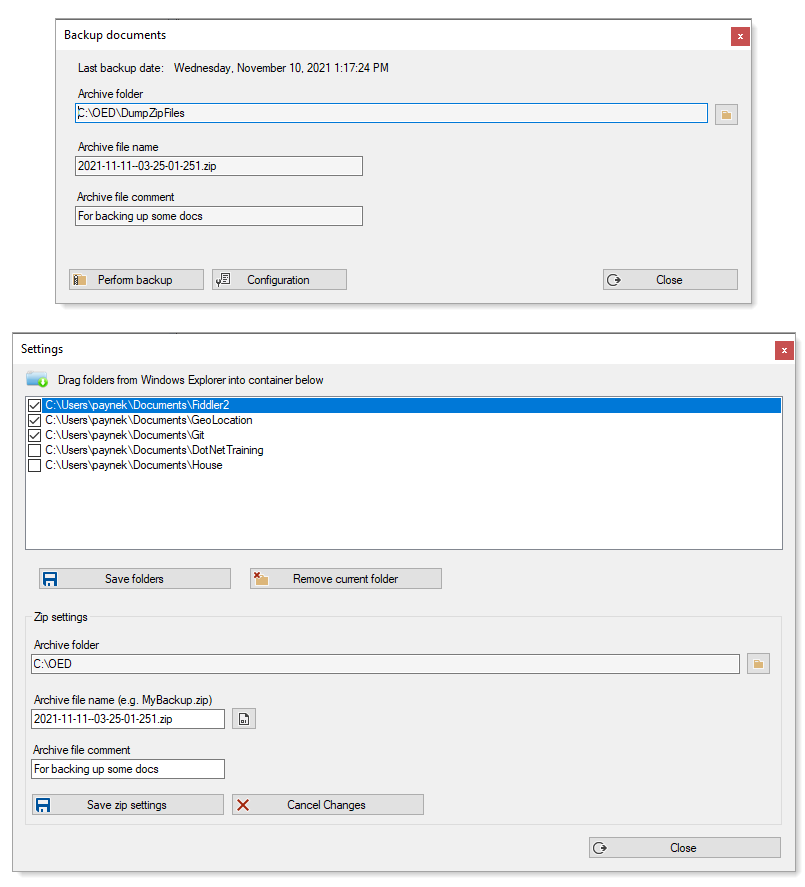
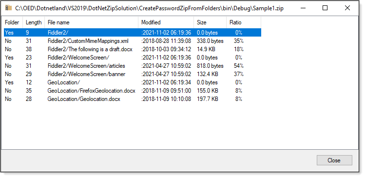

# Introduction

Learn how to create archive (.zip) files using Microsoft classes, a dontationware library known as DotNetZip and a third party library, Telerik/Progress.

Each of these provide basic functionality to create and extract file archive.

**Note**: recommendation, if this article can not answer a specific question ask on [Stackoverflow](https://stackoverflow.com/search?q=%5Bc%23%5D+zip).

When working with [DotZip](https://github.com/haf/DotNetZip.Semverd) or [Telerik libraries](https://docs.telerik.com/devtools/document-processing/libraries/radziplibrary/gettingstarted) which offer password protection after a first time extraction a password is no longer required.

> windows 10 saves the password of zip folders during your login session. Once you enter your zip password once, you can access the file as many times as you want during one login session


### Paths

:red_circle: In many code samples there are hard coded paths e.g. C:\OED... change these paths to a folder such as C:\DotNetZipTesting.

---

# Microsoft: System.IO.Compression.ZipFile

[System.IO.Compression.ZipFile](https://docs.microsoft.com/en-us/dotnet/api/system.io.compression.zipfile?view=net-5.0)

[Method](https://docs.microsoft.com/en-us/dotnet/api/system.io.compression.ziparchiveentry.delete?view=net-5.0)

For common operations Zip file class provided everything a developer requires to create and extract items from archive files. For more complex operations which requires creating archive files from one or more folders that are not related e.g. one folder `C:\Data`, another `C:\Archives` and perhaps `D:\Data` ZipFile class requires decent amount of code. Also no events nor easy way to track progress for creating or extraction operations. Need to password protect a archive this class does not provide password projection.

Even with these deficiencies Microsoft has done well by providing these methods to developers.

| To  | Use | Overloads |
| :--- | :--- | :--- |
| Create a zip archive from a directory | [CreateFromDirectory](https://docs.microsoft.com/en-us/dotnet/api/system.io.compression.zipfile.createfromdirectory?view=net-5.0) | &check; |
| Extract the contents of a zip archive to a directory | [ExtractToDirectory](https://docs.microsoft.com/en-us/dotnet/api/system.io.compression.zipfile.extracttodirectory?view=net-5.0) | &check; |
| Add new files to an existing zip archive | [CreateEntry](https://docs.microsoft.com/en-us/dotnet/api/system.io.compression.ziparchive.createentry?view=net-5.0)  | &check; |
| Retrieve a file in a zip archive | [GetEntry](https://docs.microsoft.com/en-us/dotnet/api/system.io.compression.ziparchive.getentry?view=net-5.0) | &cross;|
| Retrieve all of the files in a zip archive | [Entries](https://docs.microsoft.com/en-us/dotnet/api/system.io.compression.ziparchive.entries?view=net-5.0) | &cross; |
| To open a stream to an individual file contained in a zip archive | [Open](https://docs.microsoft.com/en-us/dotnet/api/system.io.compression.ziparchiveentry.open?view=net-5.0) | &cross; |
| Delete a file from a zip archive | [Delete](https://docs.microsoft.com/en-us/dotnet/api/system.io.compression.ziparchiveentry.delete?view=net-5.0) | &cross; |


**Simple code sample in this repository**

Before running

- Change paths in [this section](https://github.com/karenpayneoregon/dotnetzip-operations/blob/article/ExtractFilesWithProgress/Form1.cs#L36:L41) of code.
- Modify the [following](https://github.com/karenpayneoregon/dotnetzip-operations/blob/article/ExtractFilesWithProgress/Form1.cs#L241) if used in a production environment


# DotNetZip

This library should be considered when Microsoft's archive classes do not meet specific requirements like notifictions of events, perhaps having the ability to validate a password for an archive file.

All code samples can be found in [ZipOperations](https://github.com/karenpayneoregon/dotnetzip-operations/blob/article/CompressionLibrary/ZipOperations.cs) class.

Since this library supports various events (which Microsoft's classes do not events) which can make

- Presenting progress back to the user interface easy and simple.
- Notifications when various operations have completed possible like finished creating an archive file, finished extracting files from archive.
- When there are runtime issues for this library. 
- There are countless [test methods](https://github.com/haf/DotNetZip.Semverd/blob/master/src/Zlib%20Tests/ZlibUnitTest1.cs) to work with

## Asynchronous

Since working with many files and or folders, code in ZipOperations are asynchronous to keep the user interface responsive. If a developer has only a few files and/or folders best to keep asynchronous as this will not degrade application performance.

## Diving in level 1 creating archive files

Rather than starting off with a simple create archive, this code sample shows adding to folders to an archive just a tad pass simple.

- zip.AddDirectory(unprotectedPath); adds a folder which is not password protected.
- zip.AddDirectory(path); will be protected as per zip.Password = "password";

```csharp
public static void Demo(string unprotectedPath, string path, string outputPath)
{
    using (ZipFile zip = new ZipFile())
    {
        zip.AddDirectory(unprotectedPath);
        zip.Password = "password";
        //...but this will be password protected
        zip.AddDirectory(path);
        zip.Save(outputPath);
    }
}
```

While this code will protect both entries because we set password first before adding any entries.

```csharp
public static void Demo(string unprotectedPath, string path, string outputPath)
{
    using (ZipFile zip = new ZipFile())
    {
        zip.Password = "password";
        zip.AddDirectory(unprotectedPath);
        zip.AddDirectory(path);
        zip.Save(outputPath);
    }
}
```

:bulb: Many methods like `AddDirectory` have overloads, [AddDirectory (directoryName)](https://documentation.help/DotNetZip/3d01a0e2-c96e-f135-a78a-3668aefeda43.htm) and [AddDirectory (directoryName, directoryPathInArchive)](https://documentation.help/DotNetZip/ff003409-f713-7b75-e11e-08a92403a6c2.htm) so knowing this `take time` to read the documentation.

## Diving in level 2 creating archive files

Suppose a requirement is to allow a client to drag and drop directories to a ListView, allow them to exclude one or more directories? In the following example when a directory or directories are dropped into the ListView they are by default checked, the user can un-check one or more which indicates they are to be excluded when creating the archive file. Also, think ahead, duplicates are ignored and when directory is dropped becomes the selected row so the user can see it's a duplicate.



Let's look at what it takes to create an archive with the above reqirements.

```csharp
public async Task CreateWithPasswordTask()
{
    var fileName = ZipFileName;

    if (File.Exists(fileName))
    {
        File.Delete(fileName);
    }

    await Task.Run(async () =>
    {
        await Task.Delay(1);

        using (var zip = new ZipFile())
        {
            zip.ZipError += OnZipError;
            zip.SaveProgress += ZipOnSaveProgress;
            
            if (UsePassword && !string.IsNullOrWhiteSpace(Password))
            {
                zip.Password = Password;

                if (UseEncryption)
                {
                    zip.Encryption = EncryptionAlgorithm.WinZipAes256;
                }
                
            }

            if (AddDirectoryList.Count >1)
            {
                var (folderName, exception) = FileHelpers.CreateUniqueTempDirectory();

                /*
                 * Insufficient permissions to create temp folder
                 */
                if (exception != null)
                {
                    throw exception;
                }

                _uniqueTempDirectory = folderName;

                foreach (var directoryName in AddDirectoryList)
                {
                    // create folder under temporary directory
                    Directory.CreateDirectory(Path.Combine(folderName, Path.GetFileName(directoryName)));

                    // copy folder with sub-directories
                    FileHelpers.CopyFilesRecursively(directoryName, Path.Combine(folderName, Path.GetFileName(directoryName)));
                }

            }
            else
            {
                zip.AddDirectory(AddDirectoryList.FirstOrDefault());
            }

            // remove any exclusion folders
            if (RemoveSelectedEntryList.Count > 0)
            {
                RemoveSelectedEntryList.ForEach(entry => zip.RemoveSelectedEntries(entry));
            }

            if (!string.IsNullOrWhiteSpace(ZipFileComment))
            {
                zip.Comment = ZipFileComment;
            }

            try
            {
                
                if (File.Exists(ZipFileName))
                {
                    File.Delete(ZipFileName);
                }

            }
            catch (Exception ex)
            {
                ErrorHandler?.Invoke(ex);
            }

            // Single directory
            if (string.IsNullOrWhiteSpace( _uniqueTempDirectory ))
            {
                zip.Save(ZipFileName);
            }
            else
            {
                // add unique temporary directory containing multiple folders
                zip.AddDirectory( _uniqueTempDirectory );
                zip.Save(ZipFileName);

                // remove temporary directory
                var ( _ , exception) = FileHelpers.RemoveUniqueTempDirectory( _uniqueTempDirectory );
                if (exception != null)
                {
                    ErrorHandler?.Invoke(exception);
                }
                zip.Dispose();

            }
        }
    });
}
```

1. Check if the archive files currently exists, if yes, delete the file.
2. Subscribe to ZipError to notify the caller if an exception is raised during the create process.
3. Subscribe to SaveProgress, invoked when the Save method executes.
4. Set the archive password if a password has been passed.
5. Add directories using AddDirectoryList which is a list of string for directories to include in the file
   * A temp folder is created when AddDirectoryList count is greater then zero for each directory with a unique name.
   * When processing is done the folder is removed.
   * Each folder is copied recursively
6. if there are exclusions they are removed and not included in the archive
7. If a comment was passed, the comment is assigned to the archive file
8. Create the archive file.
9. Remove the temp directory

**Important** when removing the temp direcory

In some cases a file in the temp directory may be marked as read-only which if not handled properly will raise a run time exception. This is done using the following method.

```csharp
public static void SetReadOnlyFlagForAllFiles(DirectoryInfo directoryInfo, bool readOnlyValue)
{
    // Iterate over ALL files using "*" wildcard and choosing to search all directories.
    foreach (FileInfo fileInfo in directoryInfo.GetFiles("*", SearchOption.AllDirectories))
    {
        fileInfo.IsReadOnly = readOnlyValue;
    }
}
```

From 

```csharp
public static (bool success, Exception exception) RemoveUniqueTempDirectory(string tempDirectory)
{
    if (string.IsNullOrWhiteSpace(tempDirectory)) return (true, null);

    var di = new DirectoryInfo(tempDirectory);

    try
    {

        if (Directory.Exists(tempDirectory))
        {
            SetReadOnlyFlagForAllFiles(di, false);
            Directory.Delete(tempDirectory, true);
        }

        return (true, null);

    }
    catch (Exception exception)
    {
        return (false, exception);
    }

}

```

If for any reason there is still an exception raised a developer can check via the first part of the return of type named Value Tuple.

In the above methods, each directory added to the archive will include its original path, in the following code sample the focus is on allowing or disallowing the original path to be included controlled by parameter `directoryPathInArchive`.

```csharp
public Exception CreateFromSingleFolder(List<string> fileList, string zipFileName, string directoryPathInArchive = "")
{
    try
    {
        if (File.Exists(zipFileName))
        {
            File.Delete(zipFileName);
        }

        using (var zip = new ZipFile())
        {
            foreach (var fileName in fileList)
            {
                zip.AddFile(fileName, directoryPathInArchive);
            }

            zip.Save(zipFileName);
        }

        return null;
    }
    catch (Exception exception)
    {
        return exception;
    }
}
```

Another option, remove a single file from an existing archive. In this case we assume the entry exists as there is a user interface to select files in archive to select from.

:stop_sign: Documentation says `zip["Readme.txt"] = null;` which does not work now so use the following.

</br>

```csharp
public void RemoveSingleFileFromFile(Entry entry, string zipFileName)
{

    using (var zip = ZipFile.Read(zipFileName))
    {
         if (zip.EntryFileNames.Contains(entry.FileName))
        {
            zip.RemoveEntry(entry);
            zip.Save();
        }

    }
}
```

</br>

Optional, wrap in a try-catch, return a bool or (bool,Exception) named Value Tuple if confirmation is needed.

:gear: For getting a broad view of DotNetZip download the source, build the following [tool](https://github.com/haf/DotNetZip.Semverd/tree/master/src/Tools/WinFormsApp), run and check out the features without writing a single line of code.

:gear: Ready to run [console project](https://github.com/haf/DotNetZip.Semverd/blob/master/src/Tools/ZipIt/ZipIt.cs).

:gear: [Command-line tool](https://github.com/haf/DotNetZip.Semverd/tree/master/src/Tools/ConvertZipToSfx) that creates a self-extracting Zip archive, given a standard zip archive.

## Complete create archive

The project UserDocumentControl is an example for creating archive files where

- Archive folder is stored in a json file and restored when the application runs.
- Archive file name is stored in a json file and restore when the appliation runs
  - Provies an option to enter a file name or allows the application to generate an archive file name which is in the format of `YYYY-DD-MM--HH-MM-SS-MS.zip`  example 2021-10-11--13-15-34-1534.zip
- Provides drop folders from Windows Explorer
- Basic logging which currently is in Program.cs and can be placed in any code using the following singleton class `LogLibrary.ApplicationTraceListener`

**Configuration file** - configuration.json in the application folder

```json
{
  "ArchiveFolder": "C:\\OED\\DumpZipFiles",
  "ArchiveFileName": "2021-11-11--03-25-01-251.zip",
  "ArchiveFileComment": "For backing up some docs",
  "LastBackup": "2021-11-10T13:17:24.2099736-08:00",
  "LastFolderBrowsed": "C:\\OED",
  "LastFolderBrowsedIsValid": true,
  "ArchiveFileNameIsValid": true
}
``` 

**Folder selections** FolderSelections.json  in the application folder. Note `ShortName` property is provided in the event the folder is very long and may need to be used where a method has issues with long names and/or spaces in the folder name.

```json
[
  {
    "IncludeFolder": true,
    "DirectoryName": "C:\\Users\\paynek\\Documents\\Fiddler2",
    "ShortName": "C:\\Users\\paynek\\DOCUME~1\\Fiddler2"
  },
  {
    "IncludeFolder": true,
    "DirectoryName": "C:\\Users\\paynek\\Documents\\GeoLocation",
    "ShortName": "C:\\Users\\paynek\\DOCUME~1\\GEOLOC~1"
  },
  {
    "IncludeFolder": true,
    "DirectoryName": "C:\\Users\\paynek\\Documents\\Git",
    "ShortName": "C:\\Users\\paynek\\DOCUME~1\\Git"
  }
]
```




## Diving in extracting from archive file

The following screenshot provides a method to get all fiiles in an achive file, indicate if an entry is a file or folder, last modified, size and ratio.



```csharp
public List<Entry> ViewZipFileContents(string fileName)
{
    var entries = new List<Entry>();

    if (Directory.Exists(UnZipFolderName))
    {
        Directory.Delete(UnZipFolderName, true);
    }

    using (var zip = ZipFile.Read(fileName))
    {
        foreach (ZipEntry entry in zip)
        {
            entries.Add(new Entry(entry));
        }
    }

    return entries;
}

```

**Entry definition**

Which inherits [ZipEntry](https://github.com/haf/DotNetZip.Semverd/blob/master/src/Zip.Shared/ZipDirEntry.cs) from DotNetZip

- `ItemArray` is for populating a ListView, see [the following](https://github.com/karenpayneoregon/dotnetzip-operations/blob/article/CreatePasswordZipFromFolders/ViewZipFileForm.cs#L38:L44).
- `new` is used on several properties to hide base properties

```csharp
using Ionic.Zip;

namespace CompressionLibrary.Classes
{
    /// <summary>
    /// Since ZipEntry is not a partial class we must create our own class
    /// </summary>
    /// <remarks>
    /// The "new" modifier
    /// It's used to tell the compiler that the given C# property, method or member hides a similar
    /// member in the base class, in this case <see cref="ZipEntry"/> in ZipFile class.
    /// </remarks>
    public class Entry : ZipEntry
    {
        public Entry(ZipEntry source)
        {
            FileName = source.FileName;
            UncompressedSize = source.UncompressedSize;
            CompressionRatio = source.CompressionRatio;
            LastModified = source.LastModified;
            UsesEncryption = source.UsesEncryption;
            IsDirectory = source.IsDirectory;
            Length = source.FileName.Length;
            Comment = source.Comment;
        }

        public new long UncompressedSize { get; set; }
        public new double CompressionRatio { get; set; }
        public new bool UsesEncryption { get; set; }
        public new bool IsDirectory { get; set; }
        public int Length { get; set; }

        public EntryTag Tag => new EntryTag()
        {
            FileName = FileName, 
            Length = Length,
            IsDirectory = IsDirectory,
            IsFolder = IsDirectory ? "Yes" : "No",
            Comment = Comment ?? ""
        };

        public string[] ItemArray => new[]
        {
            Tag.IsFolder,
            Length.ToString(),
            FileName,
            $"{LastModified::yyyy-MM-dd HH:mm:ss}",
            FileHelpers.SizeSuffix(UncompressedSize),
            $"{CompressionRatio,5:F0}%"
        };
    }
}
```

**Password check/validation**

If an archive has a password and being extracted in an application where the user must enter a password, use the following method to valid the password. Note the method in DotNetZip take several seconds.

**Unit test method**

```csharp
/// <summary>
/// Warning, this is method take over four seconds to run.
/// </summary>
/// <returns></returns>
[TestMethod]
[TestTraits(Trait.ZipOperations)]
public async Task CheckZipFilePasswordTest()
{
    var isValidPassword = await ZipPasswordTester.IsValidFilePassword(ZipFileName, _password);
    Assert.IsTrue(isValidPassword);
}
```

**Source**

```csharp
using System.Threading.Tasks;
using Ionic.Zip;
namespace CompressionLibrary
{
    public partial class ZipPasswordTester
    {
        /// <summary>
        /// Check if password for file is valid
        /// </summary>
        /// <param name="fileName">file compressed with password using DotNetZip</param>
        /// <param name="password">Password to validate</param>
        /// <returns>true if valid password, false if password is invalid</returns>
        /// <remarks>
        /// Must run async as CheckZipPassword takes time to run.
        /// </remarks>
        public static async Task<bool> IsValidFilePassword(string fileName, string password)
        {
            var result = false;

            await Task.Run(async () =>
            {
                await Task.Delay(10);
                result = ZipFile.CheckZipPassword(fileName, password);
            });

            return result;

        }
        /// <summary>
        /// Validate password for <see cref="ZipEntry"/>
        /// </summary>
        /// <param name="entry">Entity to check</param>
        /// <param name="password">Password to validate</param>
        /// <returns>true if valid, false if invalid password</returns>
        public static bool CheckPassword(ZipEntry entry, string password)
        {
            try
            {
                using (var itemCheckStream = new PasswordCheckStream())
                {
                    entry.ExtractWithPassword(itemCheckStream, password);
                }

                return true;
            }
            catch (BadPasswordException)
            {
                return false;
            }
            catch (PasswordCheckStream.GoodPasswordException)
            {
                return true;
            }
        }
    }
}
```

To determine if a **file exits in archive**

```csharp
/// <summary>
/// Find <see cref="Entry"/> by file name
/// </summary>
/// <param name="fileName">zip file name</param>
/// <param name="entryFileName">file name to find in fileName</param>
/// <returns></returns>
public Entry FindEntry(string fileName, string entryFileName) =>
    ViewZipFileContents(fileName).FirstOrDefault(item => item.FileName == entryFileName);

/// <summary>
/// Determine if a file name exists in a .zip file
/// </summary>
/// <param name="fileName">zip file to check</param>
/// <param name="entryFileName">file name in .zip file to find</param>
/// <returns></returns>
public bool ContainsEntry(string fileName, string entryFileName)
{
    using (var zip = ZipFile.Read(fileName))
    {
        return zip.Any(entry => entry.FileName == entryFileName);
    }
}
```

### Extract with no password no progressbar

**Usage**

```csharp
private async void UnzipButton_Click(object sender, EventArgs e)
{
    UnzipButton.Enabled = false;
    progressBar1.Visible = true;
    CurrentExtractonLabel.Visible = true;

    var zipOperations = new ZipOperations
    {
        Password = PasswordTextBox.Text,
        UnZipFolderName = Path.Combine(AppDomain.CurrentDomain.BaseDirectory, "Extracted")
    };

    zipOperations.ExtractFinishedHandler += ZipOperationsOnExtractFinishedHandler;
    zipOperations.SendProgressUpdate += ZipOperationsOnSendProgressUpdate;

    try
    {
        await zipOperations.DecompressNoPasswordTask(SaveFileNameTextBox.Text, @"C:\OED\DumpZipFiles");
    }
    finally
    {
        UnzipButton.Enabled = true;
        await Task.Delay(500);
        progressBar1.Visible = false;
        CurrentExtractonLabel.Visible = false;
    }

    zipOperations.ExtractFinishedHandler -= ZipOperationsOnExtractFinishedHandler;

}
```

**Source**

```csharp
public async Task DecompressNoPasswordTask(string fileName, string destinationFileName = "")
{

    if (!string.IsNullOrWhiteSpace(destinationFileName))
    {
        UnZipFolderName = destinationFileName;
    }

    ZipEntry currentEntry = new ZipEntry();

    string extractPath = @"C:\OED\DumpZipFiles";

    if (Directory.Exists(extractPath))
    {
        var di = new DirectoryInfo(extractPath);
        FileHelpers.SetReadOnlyFlagForAllFiles(di, false);

        if (Directory.Exists(extractPath))
        {
            Directory.Delete(extractPath, true);
        }
    }


    await Task.Run(async () =>
    {

        using (var zip = ZipFile.Read(fileName))
        {
            //zip.ExtractProgress += ExtractProgress;
            zip.ExtractProgress += ZipOnExtractProgress;

            var selection = from zipEntry in zip.Entries select zipEntry;

            try
            {
                foreach (ZipEntry entry in selection)
                {
                    currentEntry = entry;
                    entry.Extract(extractPath);
                }
            }
            catch (Exception ex)
            {
                // TODO
            }
        }

        /*
         * arbitrary time done with experimentation 
         */
        await Task.Delay(500);

    });
}
```

### Extract with no password with progressbar

```csharp
private async void UnzipButton_Click(object sender, EventArgs e)
{
    UnzipButton.Enabled = false;
    progressBar1.Visible = true;
    CurrentExtractonLabel.Visible = true;

    var zipOperations = new ZipOperations
    {
        Password = PasswordTextBox.Text,
        UnZipFolderName = Path.Combine(AppDomain.CurrentDomain.BaseDirectory, "Extracted")
    };

    zipOperations.ExtractFinishedHandler += ZipOperationsOnExtractFinishedHandler;
    zipOperations.SendProgressUpdate += ZipOperationsOnSendProgressUpdate;

    try
    {
        await zipOperations.DecompressNoPasswordTask(SaveFileNameTextBox.Text, @"C:\OED\DumpZipFiles");
    }
    finally
    {
        UnzipButton.Enabled = true;
        await Task.Delay(500);
        progressBar1.Visible = false;
        CurrentExtractonLabel.Visible = false;
    }

    zipOperations.ExtractFinishedHandler -= ZipOperationsOnExtractFinishedHandler;

}

/// <summary>
/// Prevent cross-threading
/// </summary>
private void ZipOperationsOnSendProgressUpdate(object sender, ExtractProgressEventArgs e)
{
    if (InvokeRequired)
    {
        Invoke(new Action<object, ExtractProgressEventArgs>(UpdateProgress), sender, e);
    }
}
/// <summary>
/// Super simple report progress on archive extraction
/// </summary>
private void UpdateProgress(object arg1, ExtractProgressEventArgs e)
{

    if (e.TotalBytesToTransfer <= 0) return;

    progressBar1.Value = Convert.ToInt32(100 * e.BytesTransferred / e.TotalBytesToTransfer);
    CurrentExtractonLabel.Text = e.CurrentEntry.FileName;

}
```

# File helpers

In many cases there are resonsibilites that will be used more than once so they are placed into a class.

- [DateTimeFromFileName](https://github.com/karenpayneoregon/dotnetzip-operations/blob/article/CompressionLibrary/FileHelpers.cs#L173) is not used although the possible use is to sort file name created with [UniqueFileName](https://github.com/karenpayneoregon/dotnetzip-operations/blob/article/CompressionLibrary/FileHelpers.cs#L162) can come in handy to sort file names properly be date/time.

```csharp
using System;
using System.Collections.Generic;
using System.Globalization;
using System.IO;
using System.Linq;
using System.Text;
using System.Threading.Tasks;

namespace CompressionLibrary
{
    public static class FileHelpers
    {
        /// <summary>
        /// Copy files in parent and child folders. Caller is an async task
        /// </summary>
        /// <param name="sourcePath"></param>
        /// <param name="targetPath"></param>
        public static void CopyFilesRecursively(string sourcePath, string targetPath)
        {
            foreach (string dirPath in Directory.GetDirectories(sourcePath, "*", SearchOption.AllDirectories))
            {
                Directory.CreateDirectory(dirPath.Replace(sourcePath, targetPath));
            }

            foreach (string newPath in Directory.GetFiles(sourcePath, "*.*", SearchOption.AllDirectories))
            {
                File.Copy(newPath, newPath.Replace(sourcePath, targetPath), true);
            }
        }

        private static readonly string[] SizeSuffixes = { "bytes", "KB", "MB", "GB", "TB", "PB", "EB", "ZB", "YB" };

        /// <summary>
        /// Format int as readable file size
        /// </summary>
        /// <param name="value">value to format</param>
        /// <param name="decimalPlaces">decimal places, default is 1</param>
        /// <returns></returns>
        public static string SizeSuffix(long value, int decimalPlaces = 1)
        {

            if (value < 0)
            {
                return "-" + SizeSuffix(-value);
            }

            int size = 0;
            var dValue = (decimal)value;

            while (Math.Round(dValue, decimalPlaces) >= 1000)
            {
                dValue /= 1024M;
                size += 1;
            }

            return string.Format("{0:n" + decimalPlaces + "} {1}", dValue, SizeSuffixes[size]);

        }

        /// <summary>
        /// Creates the unique temporary directory.
        /// </summary>
        /// <returns>
        /// Directory path.
        /// </returns>
        public static (string folderName, Exception exception) CreateUniqueTempDirectory()
        {
            var uniqueTempDir = Path.Combine(Path.GetTempPath(), Path.GetRandomFileName());

            try
            {
                Directory.CreateDirectory(uniqueTempDir);
                return (uniqueTempDir, null);
            }
            catch (Exception exception)
            {
                return (null, exception);
            }

        }

        /// <summary>
        /// Clean up
        /// </summary>
        /// <param name="tempDirectory"></param>
        /// <returns></returns>
        public static (bool success, Exception exception) RemoveUniqueTempDirectory(string tempDirectory)
        {
            if (string.IsNullOrWhiteSpace(tempDirectory)) return (true, null);

            var di = new DirectoryInfo(tempDirectory);

            try
            {

                if (Directory.Exists(tempDirectory))
                {
                    SetReadOnlyFlagForAllFiles(di, false);
                    Directory.Delete(tempDirectory, true);
                }

                return (true, null);

            }
            catch (Exception exception)
            {
                return (false, exception);
            }

        }

        /// <summary>
        /// Set read-only attribute for each file in a folder
        /// </summary>
        /// <param name="directoryInfo">Directory to recursively iterate to set file attribute to false or true</param>
        /// <param name="readOnlyValue">True to set, false to remove</param>
        public static void SetReadOnlyFlagForAllFiles(DirectoryInfo directoryInfo, bool readOnlyValue)
        {
            // Iterate over ALL files using "*" wildcard and choosing to search all directories.
            foreach (FileInfo fileInfo in directoryInfo.GetFiles("*", SearchOption.AllDirectories))
            {
                fileInfo.IsReadOnly = readOnlyValue;
            }
        }

        /// <summary>
        /// Recursively set file attributes to <see cref="FileAttributes.Normal"/>
        /// </summary>
        /// <param name="parentDirectory"></param>
        /// <code>
        ///  DirectoryInfo parentDirectoryInfo = new DirectoryInfo(@"C:\OED");
        ///  ClearReadOnly(parentDirectoryInfo);
        /// </code>
        public static void ClearReadOnly(DirectoryInfo parentDirectory)
        {
            if (parentDirectory == null) return;

            parentDirectory.Attributes = FileAttributes.Normal;

            foreach (FileInfo fileInfo in parentDirectory.GetFiles())
            {
                fileInfo.Attributes = FileAttributes.Normal;
            }

            foreach (DirectoryInfo directoryInfo in parentDirectory.GetDirectories())
            {
                ClearReadOnly(directoryInfo);
            }

        }

        /// <summary>
        /// Create a unique file name
        /// </summary>
        /// <param name="useGuid">true to include Guid, false to exclude Guid</param>
        /// <param name="extension">File extension with period, if not specified .zip is used</param>
        /// <returns>unique file name</returns>
        /// <remarks>
        ///  -- is used to separate date part from time part, feel free to change this
        /// Change this methods logic the method <see cref="DateTimeFromFileName"/> must be altered
        /// </remarks>
        public static string UniqueFileName(bool useGuid,string extension = ".zip") => useGuid ? 
            $"{DateTime.Now:yyyy-dd-M--HH-mm-ss-ms}{Guid.NewGuid()}{extension}" : 
            $"{DateTime.Now:yyyy-dd-M--HH-mm-ss-ms}{extension}";


        /// <summary>
        /// Helper for <see cref="UniqueFileName"/> to split out date time from file name
        /// </summary>
        /// <param name="source">Created with <see cref="UniqueFileName"/></param>
        /// <returns>DateTime</returns>
        /// <returns>DateTime</returns>
        public static DateTime DateTimeFromFileName(string source)
        {
            /*
             * Can split easily when we have -- and - in the string so change -- to ~ and remove the extension
             */
            var sanitized = source.Replace("--", "~").Replace(".zip", "").Split('~');

            /*
             * Since replacing -- with ~ we can properly get time element
             */
            var parts = sanitized[1].Split('-');

            /*
             * Combine data part (element 0) with time part (element 1)
             * and create our date time
             */
            var thisTime = $"{parts[0]}:{parts[1]}:{parts[2]}";

            return Convert.ToDateTime($"{sanitized[0]} {thisTime}", CultureInfo.InvariantCulture);
        }
    }
}
```

# Unit test project

Take note of MainTest.cs under the Base folder, [Initialization method](https://github.com/karenpayneoregon/dotnetzip-operations/blob/article/FileOperationsTest/Base/MainTest.cs#L31:L54) has logic for specific test for preparation prior to running test.


# Telerik code samples

This library has powerful features but lacks events which is one reason DotNetZip shines. Since this is a third party paid for library this project is in the solution folder but not part of the solution. The best way to explore code is open this repository by typing <kbd>.</kbd> then traverse to the code using Visual Studio code web edition.

Create an archive with password

```csharp
private void CreateZipPasswordButton_Click(object sender, EventArgs e)
{
    

    using (Stream stream = File.Open("demo.zip", FileMode.Create))
    {
        DefaultEncryptionSettings encryptionSettings = new DefaultEncryptionSettings
        {
            Password = "password"
        };

        using (var archive1 = new ZipArchive(stream, ZipArchiveMode.Create, false, null, null, encryptionSettings))
        {
            using (ZipArchiveEntry textFileEntry = archive1.CreateEntry("text.txt"))
            {
                StreamWriter writer = new StreamWriter(textFileEntry.Open());
                writer.WriteLine("Hello world!");
                writer.Flush();
            }

            archive1.CreateEntryFromFile("Doc1.docx", "doc.docx", CompressionLevel.Best);
            
        }
    }
}
```

Create archive, no password using a custom method

```csharp
private async void FromFolderRecursiveButton_Click(object sender, EventArgs e)
{
    var (success, exception) = await ZipOperations.FromDirectory(@"C:\OED\Documents", "dump.zip");

    MessageBox.Show(success ? "Done" : $"Encountered an issue\n{exception.Message}");
}
```

**Custom operations class**

```csharp
using System;
using System.IO;
using System.Threading.Tasks;
using Telerik.Windows.Zip;
using Telerik.Windows.Zip.Extensions;

namespace TelerikZipCodeSamples
{
    public class ZipOperations
    {
        /// <summary>
        /// Example for creating a .zip (archive) file from a folder where
        /// all sub-folders and files will be included.
        /// </summary>
        /// <param name="folder">Root folder</param>
        /// <param name="zipName">Zip file name, may include a path</param>
        /// <returns></returns>
        public static async Task<(bool success, Exception exception)> FromDirectory(string folder, string zipName)
        {
            return await Task.Run(async () =>
            {
                await Task.Delay(1);

                try
                {
                    if (File.Exists(zipName))
                    {
                        File.Delete(zipName);
                    }

                    ZipFile.CreateFromDirectory(folder, zipName);

                    return (true, null);

                }
                catch (Exception ex)
                {
                    return (false, ex);
                }
                
            });
        }

        /// <summary>
        /// Create a .zip (archive file) with password
        /// </summary>
        /// <param name="sourceDirectoryName"></param>
        /// <param name="destinationArchiveFileName"></param>
        /// <param name="password">Password for archive file</param>
        /// <returns></returns>
        public static async Task<bool> CreateEncryptedZipFileFromDirectory(string sourceDirectoryName, string destinationArchiveFileName, string password)
        {
            return await Task.Run(() =>
            {
                char[] directorySeparatorChar =
                {
                    Path.DirectorySeparatorChar, Path.AltDirectorySeparatorChar
                };

                if (!string.IsNullOrWhiteSpace(sourceDirectoryName))
                {
                    using (FileStream archiveStream = File.Open(destinationArchiveFileName, FileMode.Create))
                    {
                        // Set password to protect ZIP archive
                        DefaultEncryptionSettings encryptionSettings = new DefaultEncryptionSettings
                        {
                            Password = password
                        };

                        using (ZipArchive archive = new ZipArchive(archiveStream, ZipArchiveMode.Create, true, null, null, encryptionSettings))
                        {
                            foreach (string fileName in Directory.GetFiles(sourceDirectoryName))
                            {
                                using (FileStream file = File.OpenRead(fileName))
                                {
                                    int length = fileName.Length - sourceDirectoryName.Length;
                                    string entryName = fileName.Substring(sourceDirectoryName.Length, length);
                                    entryName = entryName.TrimStart(directorySeparatorChar);

                                    using (ZipArchiveEntry entry = archive.CreateEntry(entryName))
                                    {
                                        using (Stream entryStream = entry.Open())
                                        {
                                            file.CopyTo(entryStream);
                                        }
                                    }
                                }
                            }
                        }
                    }

                    return Task.FromResult(true);
                }
                else
                {
                    return Task.FromResult(false);
                }

            });
        }
    }
}
```


