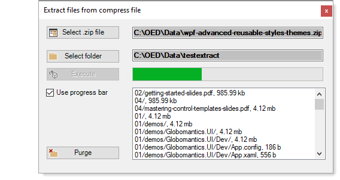
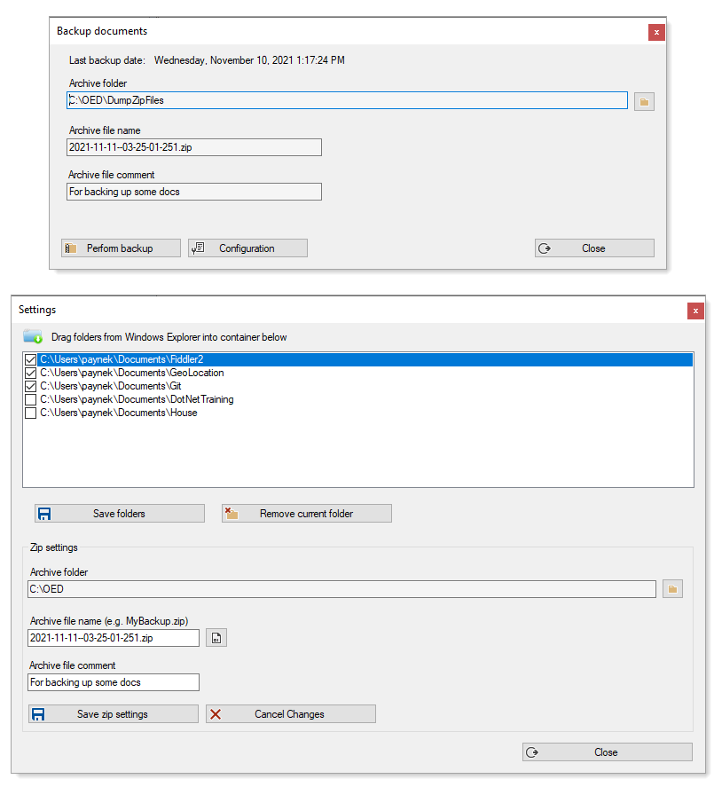
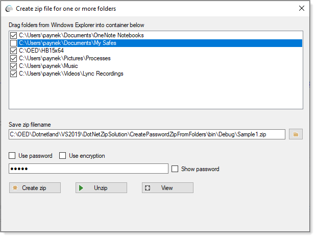
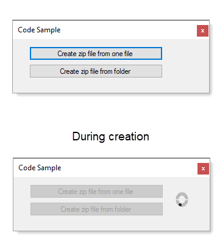

# About

:green_circle:  **See details** in [article.md](https://github.com/karenpayneoregon/dotnetzip-operations/blob/article/article.md)

A repository for creating, viewing and extraction operations using DotNetZip done with .NET Framework 4.8.

All code will run in .NET Core while not all developers have moved to .NET Core which is the reason for using .NET Framework 4.8. With DotNetZip code samples can be used cross-platform.

:small_orange_diamond: **DotNetZip** [doumentation](https://documentation.help/DotNetZip/About.htm)

:small_orange_diamond: **DotNetZip** [License](https://github.com/eropple/dotnetzip/blob/master/License.txt) and [code samples](https://documentation.help/DotNetZip/CSharp.htm) on the web.

:small_orange_diamond: **DotNetZip Nuget** [package](https://www.nuget.org/packages/DotNetZip/)

:small_orange_diamond: **Supported languages**: VB, C# or any .NET language

## .NET Framework System.IO.Compression.ZipFile

This [class](https://docs.microsoft.com/en-us/dotnet/api/system.io.compression.zipfile?view=net-5.0) provides create and extraction methods for simple operations along with [ZipFileExtensions](https://docs.microsoft.com/en-us/dotnet/api/system.io.compression.zipfileextensions?view=net-5.0) class.

# Code provided

Written in C# .NET Framework 4.8

Used NuGet package [BetterFolderBrowser](https://www.nuget.org/packages/BetterFolderBrowser/)

# See also 

[article.md](https://github.com/karenpayneoregon/dotnetzip-operations/blob/article/article.md)

# Issues

- Passwording can be problematic when attempting to extract from Windows Explorer but not when extraction is done using DotNetZip code. This is an operating system issue which could be resolved by changing the library code but that means this can be an issue if a new version is released.
- Passwording on a specific file will only require the password once per Windows login sessions for all libraries supporting passwords.
- Adding folders with long path then extracting to a extraction folder with a long path can cause a catchable runtime error from the library. This is a fringe case and there are ways around this.

# Tips

- Consider when creating an archive with multiple folders to create a temp folder, do the work, copy archive file to indended path then remove the temp folder
  - Do not assume even though code performed the above operaton the removal of the temp folder will work. There may be files that by file attributes will deny removal which means a method is needed to set each file to normal attribute.
- Consider
  - A method to create a unique temp folder and a method to remove that folder
  - Recommend a class without static methods for archive create and unzip operations
  - Use plenty of assertions rather than relying solely on try-catch statements
  - Always think about will an operation cause the user interface to become unresponsive and if so use asynchronous code.
  - In some cases asynchronous code can slow things down so test asynchronous and synchronous.